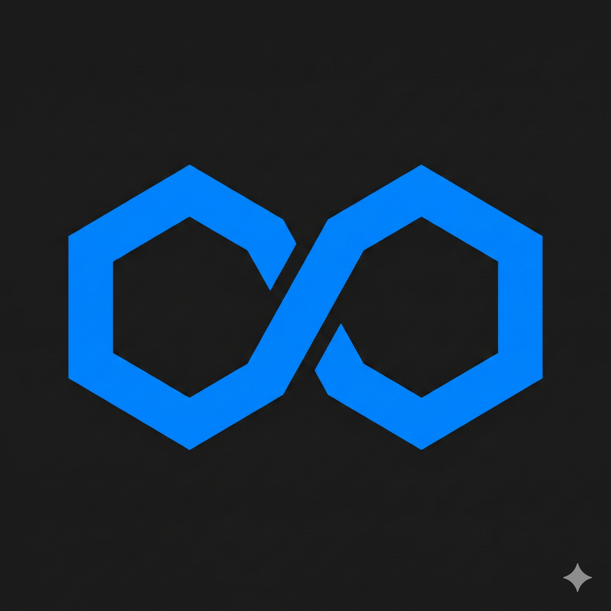

# Continuum Studio

**AI Orchestration Platform** for multi-agent control, monitoring, and verification.



---

## Overview

Continuum Studio is a modular platform for orchestrating AI agents across multiple applications and machines. It combines:

- **Desktop UI** (Rust/iced with COSMIC styling) - Dashboard for harness management and monitoring
- **Mobile App** (Kotlin/Jetpack Compose) - Remote dialog and widget bay
- **Studio Core** (Elixir/OTP) - Central orchestration hub
- **Agent Bridge** (Elixir) - Multi-provider AI abstraction layer
- **Synapsix** - Harness orchestrator, dialog daemon, terminal monitoring

## Architecture

```
                    CONTINUUM STUDIO
 ┌───────────────────────────────────────────────┐
 │                                               │
 │  ┌─────────────┐  ┌────────────┐              │
 │  │ Desktop UI  │  │ Mobile App │              │
 │  │ (Rust/iced) │  │ (Kotlin)   │              │
 │  └──────┬──────┘  └──────┬─────┘              │
 │         │   Unix Socket   │  WebSocket         │
 │         └────────┬────────┘                    │
 │                  ▼                             │
 │         ┌────────────────┐                     │
 │         │  Studio Core   │                     │
 │         │  (Elixir/OTP)  │                     │
 │         └───────┬────────┘                     │
 │                 │                              │
 │    ┌────────────┼────────────┐                 │
 │    ▼            ▼            ▼                 │
 │ ┌────────┐ ┌────────┐ ┌──────────────┐        │
 │ │ Agent  │ │Version │ │  Workspace   │        │
 │ │ Bridge │ │Registry│ │  Tracker     │        │
 │ └────────┘ └────────┘ └──────────────┘        │
 │                                               │
 └───────────────────┬───────────────────────────┘
                     │ CoreClient IPC
                     ▼
 ┌───────────────────────────────────────────────┐
 │                  SYNAPSIX                      │
 │                                               │
 │  ┌──────────┐ ┌──────────┐ ┌──────────────┐  │
 │  │ Terminal  │ │ Dialog   │ │  Harnesses   │  │
 │  │ Monitor  │ │ Daemon   │ │  (Cursor,    │  │
 │  │          │ │          │ │   Android,   │  │
 │  │          │ │          │ │   Godot)     │  │
 │  └──────────┘ └──────────┘ └──────────────┘  │
 │                                               │
 │  ┌──────────┐ ┌──────────┐ ┌──────────────┐  │
 │  │ NeSy     │ │ Service  │ │ Chat         │  │
 │  │ (Z3/SMT) │ │ Registry │ │ Pipeline     │  │
 │  └──────────┘ └──────────┘ └──────────────┘  │
 └───────────────────────────────────────────────┘
```

## Components

### Desktop UI (`ui-iced/`) - Current

**Framework**: Rust + iced 0.14 with COSMIC desktop styling

Features:
- Session management for multiple Cursor instances
- Service discovery and monitoring dashboard
- Chat message pipeline display
- VS Code theme compatibility
- Self-update system
- Settings management

```bash
cd ui-iced && cargo run --release
# Or with NixOS library paths:
./run-gui.sh
```

### Desktop UI (`ui/`) - Legacy

**Framework**: Rust + egui 0.29

Legacy implementation with D2 diagram viewer, tab system, and ETF IPC. Being replaced by iced UI.

### Android App (`android/`)

**Framework**: Kotlin + Jetpack Compose + Material 3

Features:
- **Widget Bay** - Customizable grid dashboard for monitoring
- **Dialog Client** - WebSocket connection to dialog daemon (port 8080)
- **Notification Service** - Background dialog alerts
- **Auto-reconnect** - Resilient WebSocket connection

### Studio Core (`core/studio_core/`)

**Framework**: Elixir/OTP

Central orchestration hub:
- **State Management** - ETS-backed with hot restart resilience
- **Event Bus** - Pub/sub broadcasting to all connected clients
- **Unix Socket IPC** - JSON-framed messages (`/tmp/continuum-studio.sock`)
- **Harness Registry** - Tracks connected Synapsix harnesses
- **Version Registry** - Cursor version management
- **Auth Manager** - Cursor authentication handling
- **Workspace Tracker** - Projects across Cursor versions

### Agent Bridge (`core/agent_bridge/`)

**Framework**: Elixir/OTP

Multi-provider AI abstraction:
- **Providers**: Claude (Anthropic), Ollama (local), Cursor (via harness)
- **Context Manager** - Session-based context tracking
- **Cost Tracker** - Token counting per provider
- **Rate Limiter** - Per-provider rate limiting
- **Middleware Pipeline** - Logger, Sanitizer, Validator, Telemetry, Content Filter

### Archive (`archive/`)

`cursor-docs-REBUILD-TARGET/` - Archived documentation indexing system (planned rebuild as separate service)

## Key Features

### Terminal Monitoring (New)

Deep integration with Cursor's process monitoring via Synapsix:
- CPU/memory tracking for all Cursor processes
- Agent terminal output capture
- Structured log parsing (v2.4.27+)
- Process tree visualization in dashboard

### Neurosymbolic AI (NeSy)

Agent action verification via SMT solvers:
- Constraint DSL for safety rules
- Formal verification before execution
- Complete audit trail with proofs

### Dialog System

Interactive AI agent feedback without wasting API requests:
- Native desktop dialogs (egui)
- Mobile dialogs (WebSocket + web UI)
- Priority queue, decision memory, approval workflows
- Hold mode for complex decisions
- Rich context (code diffs, file previews, progress)

### Service Discovery

DNS-SD with CoreDNS integration:
- Automatic harness registration and heartbeat
- Multi-machine discovery via mDNS
- HTTP API on port 4001

## Quick Start

```bash
# 1. Start Synapsix (required for harness control)
cd ~/synapsix && iex --sname synapsix -S mix

# 2. Start Studio Core (required for UI)
cd ~/continuum-studio/core/studio_core && iex -S mix

# 3. Start Desktop UI
cd ~/continuum-studio && ./run-gui.sh
```

### NixOS Integration

The dialog daemon and terminal monitor are managed as systemd user services via Home Manager:

```nix
homelab.synapsix = {
  enable = true;
  dialog.enable = true;
  dialog.autostart = true;
  terminalMonitor.enable = true;
};
```

## Documentation

| Document | Description |
|----------|-------------|
| `docs/ARCHITECTURE.md` | System architecture overview |
| `docs/UI_ARCHITECTURE.md` | UI component design |
| `docs/AGENT_BRIDGE_ARCHITECTURE.md` | Agent Bridge design |
| `docs/MODULE_ARCHITECTURE.md` | Module boundaries |
| `docs/ETF_PROTOCOL.md` | IPC protocol specification |
| `docs/WIDGET_BAY_DESIGN.md` | Widget bay design |
| `docs/DESIGN_PROXY_SESSION_MONITORING.md` | Session monitoring design |
| `docs/UI_PARADIGM_EXPLORATION.md` | UI paradigm rationale |

## Related Repositories

- **[synapsix](https://github.com/Distracted-E421/synapsix)** - Harness orchestrator, dialog daemon, terminal monitoring
- **[nixos-cursor](https://github.com/Distracted-E421/nixos-cursor)** - NixOS packaging for Cursor IDE
- **[homelab](https://github.com/Distracted-E421/homelab)** - NixOS infrastructure and configuration
- **[phosphor](https://github.com/Distracted-E421/phosphor)** - Wayland-native screen capture with smart storage

## License

- Core components: AGPL-3.0
- Infrastructure services: SSPL
